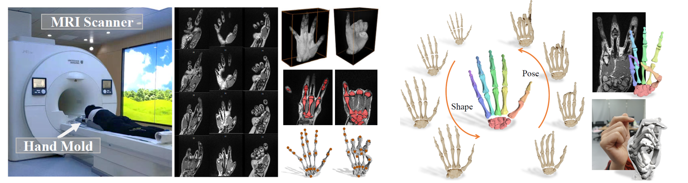
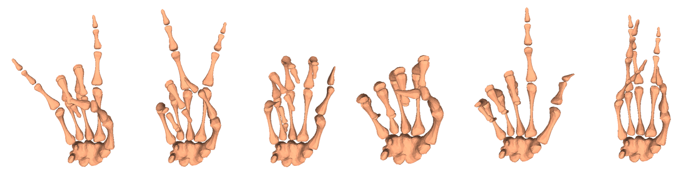

PIANO: A Parametric Hand Bone Model from Magnetic Resonance Imaging
========



PIANOLayer is a differentiable PyTorch layer that deterministically maps from pose and shape parameters to hand bone joints and vertices.
It can be integrated into any architecture as a differentiable layer to predict bone meshes for data-driven fine-grained hand bone anatomic and semantic understanding from MRI or even RGB images.

To learn about PIANO, please visit our website: https://liyuwei.cc/proj/piano

You can find the PIANO paper at: https://www.ijcai.org/proceedings/2021/0113.pdf

---

For comments or questions, please email us at: Yuwei Li (liyw@shanghaitech.edu.cn)


System Requirements:
---

Python Dependencies:
- Numpy 
- pickle
- Pytorch		 	
- Trimesh (for mesh saving)  


Getting Started:
---

Model file:
[PIANO_RIGHT_dict.pkl](assets/PIANO_RIGHT_dict.pkl)

Demo pose:
[demo_pose.pkl](assets/demo_pose.pkl)



> python demo.py


Acknowledgements:
---
This model and code was developped and used for the paper *PIANO: A Parametric Hand Bone Model from Magnetic Resonance Imaging* for IJCAI21.
See [project page](https://liyuwei.cc/proj/piano)

It reuses part of the great code from 
[manopth](https://github.com/hassony2/manopth/blob/master/manopth) by [Yana Hasson](https://hassony2.github.io/) and 
[pytorch_HMR](https://github.com/MandyMo/pytorch_HMR) by [Zhang Xiong](https://github.com/MandyMo)!


If you find this code useful for your research, consider citing:

```
@inproceedings{ijcai2021-113,
  title     = {PIANO: A Parametric Hand Bone Model from Magnetic Resonance Imaging},
  author    = {Li, Yuwei and Wu, Minye and Zhang, Yuyao and Xu, Lan and Yu, Jingyi},
  booktitle = {Proceedings of the Thirtieth International Joint Conference on
               Artificial Intelligence, {IJCAI-21}},
  publisher = {International Joint Conferences on Artificial Intelligence Organization},
  editor    = {Zhi-Hua Zhou},
  pages     = {816--822},
  year      = {2021},
  month     = {8},
  note      = {Main Track}
  doi       = {10.24963/ijcai.2021/113},
  url       = {https://doi.org/10.24963/ijcai.2021/113},
}

```
